# Enterprise-Grade Serverless Static Web Architecture: Global Distribution, Zero-Trust Storage Hardening, and Multi-Stage CI/CD Automation

## 1. Architectural Strategy & Executive Summary
This project outlines the production-ready engineering lifecycle of a high-performance serverless personal web platform deployed on Amazon Web Services (AWS). Traditional static web hosting setups (such as virtual private servers or EC2 instances) introduce continuous operational overhead, require ongoing operating system security patching, and face scaling limits under heavy concurrent traffic loads. To eliminate these infrastructure bottlenecks, this solution uses a modern, completely decoupled, serverless design pattern.

The architecture is built upon a highly durable object storage backend using **Amazon Simple Storage Service (S3)**. Global caching, edge network routing, and automated SSL/TLS termination are handled by **Amazon CloudFront**. Instead of using outdated, unauthenticated object access policies, this infrastructure enforces a strict security perimeter using CloudFront **Origin Access Control (OAC)**. This ensures the S3 storage bucket is entirely hidden from the public internet, making it impossible to access or scan files directly from an unverified public endpoint.

To streamline day-to-day operations, the entire platform is managed by an automated Continuous Integration and Continuous Deployment (CI/CD) pipeline built with **GitHub Actions**. Whenever modifications are pushed from a local **VS Code** development terminal, an ephemeral automation runner launches. This workflow securely logs into AWS using IAM programmatic API tokens, synchronizes production-ready frontend assets directly into the private S3 bucket, trims out orphaned files, and automatically creates a global cache invalidation. This process pushes live updates across global edge-node caching networks in under 15 seconds.

---

## 2. Infrastructure Architecture Blueprint

The cloud-native platform is divided into two decoupled layers: the DevOps Automation Plane and the Secured Hosting Delivery Layer.

DEVELOPMENT & DEPLOYMENT PLANE (CI/CD Automation Engine)

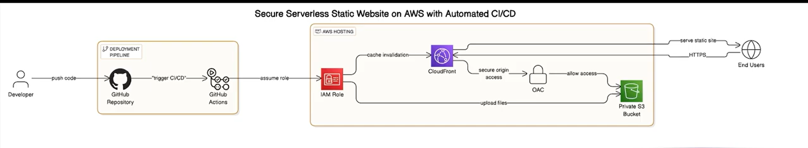

---

## 3. Comprehensive Pin-to-Pin Engineering Log

### Phase 1: Storage Layer Architecture & Object Tier Isolation (Amazon S3)
The initial stage of this project focused on provisioning a zero-maintenance object storage container to house all static frontend dependencies (`html`, `css`, `js`, and graphic assets).

1. **Bucket Provisioning:** I accessed the Amazon S3 core service engine and initialized a globally unique storage bucket. This bucket acts as the primary data store for our core tracking files.
   
   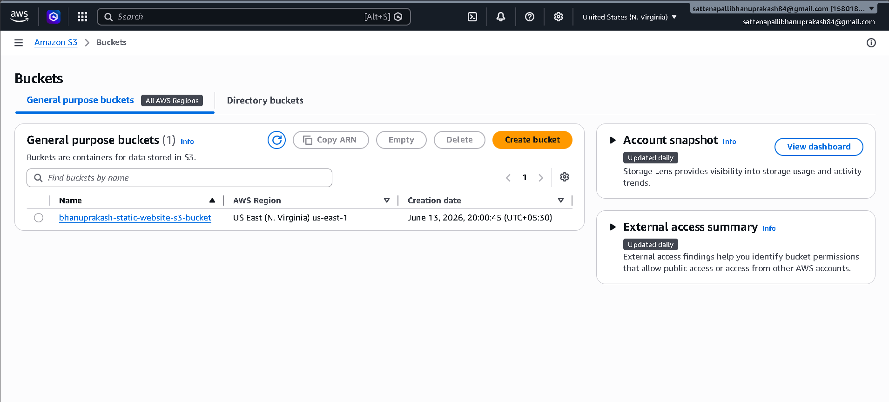

2. **Access Control Hardening Baseline:** To enforce strict data security from the very start, I enabled the **Block *all* public access** master configuration. This completely isolates the bucket, preventing malicious network scans, anonymous external web directory listings, or direct unauthenticated object downloads.
   
   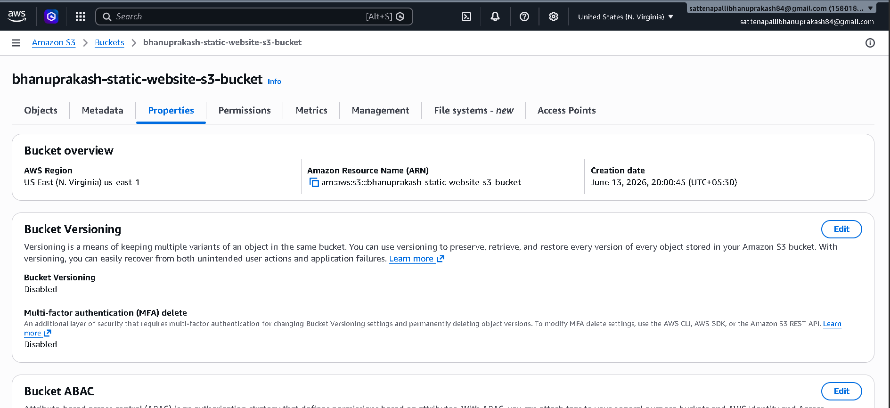

3. **Static Website Hosting Property Setup:** Inside the S3 properties tab, I enabled the native static web hosting feature. I explicitly designated **`index.html`** as the default entry point. This configures the bucket to serve web routing internally, even though direct internet traffic is blocked at the network boundary.
   
   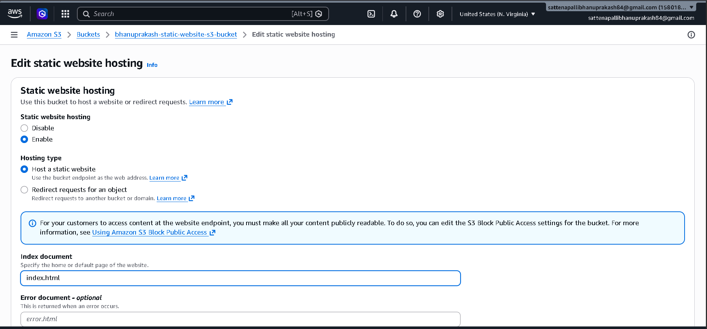

4. **Asset Upload Phase:** Using the console interface, I uploaded the initial version of the frontend web files, confirming that the critical entry point (`index.html`) was saved to the root of the file system.
   
   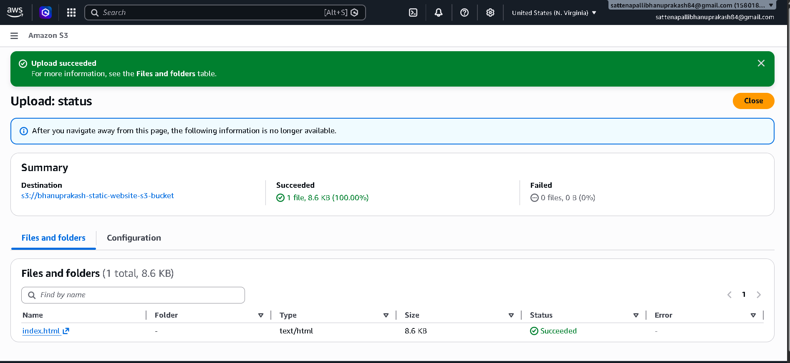

---

### Phase 2: Global Content Delivery & Access Governance (Amazon CloudFront & OAC)
To expose the website files safely to global users with minimal latency, I wrapped the private storage pool behind a global content delivery network edge-caching distribution.

1. **CloudFront Distribution Creation:** I initialized an Amazon CloudFront web distribution, mapping its origin domain parameter directly to the internal endpoint of the private S3 bucket.
   
   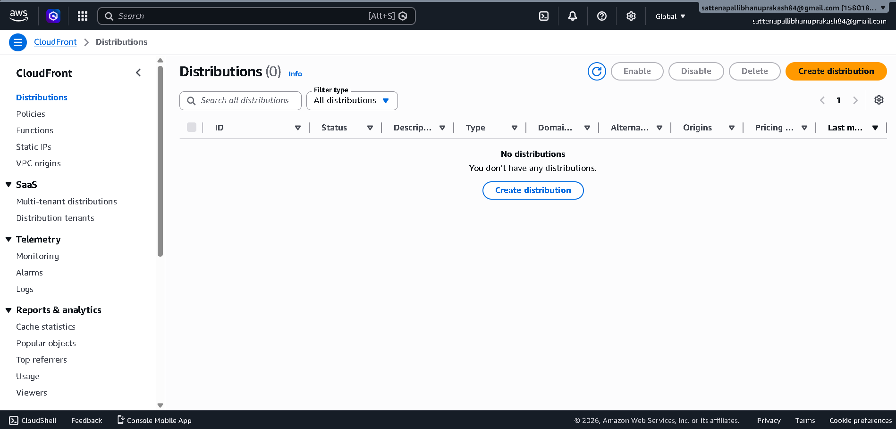

2. **Origin Access Control (OAC) Architecture:** To keep the S3 bucket hidden from the public internet, I implemented an **Origin Access Control (OAC)** profile signature framework. Unlike legacy Origin Access Identities (OAI), OAC provides enhanced security by requiring cryptographic authentication signatures for all traffic moving from CloudFront edge nodes to the S3 bucket origin.
   
   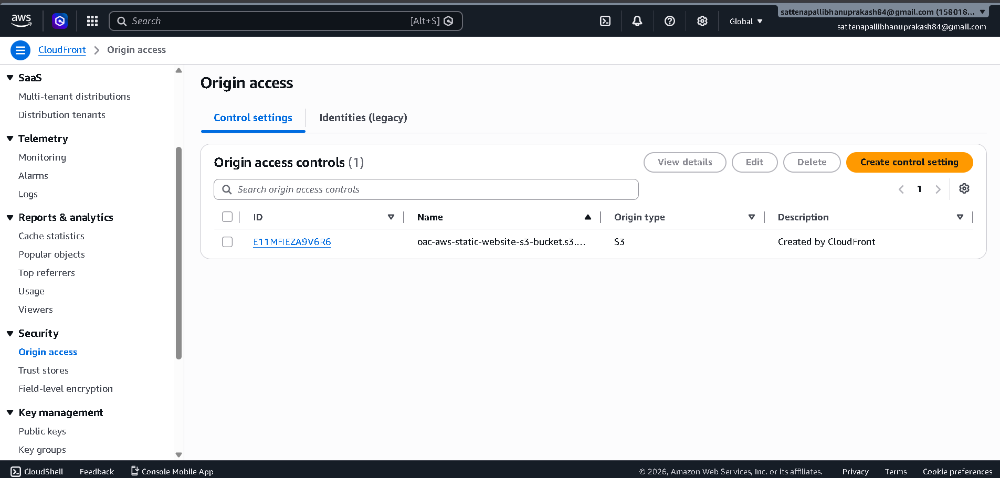

3. **S3 Bucket Policy Hardening:** To finalize the secure link between S3 and CloudFront, I updated the S3 bucket permissions with a custom, resource-based policy. This policy explicitly grants `s3:GetObject` permissions *only* to the unique CloudFront distribution service principal (`EX612QS1RFB1C`). Direct requests to the S3 bucket now return an immediate HTTP 403 Forbidden error.
   
   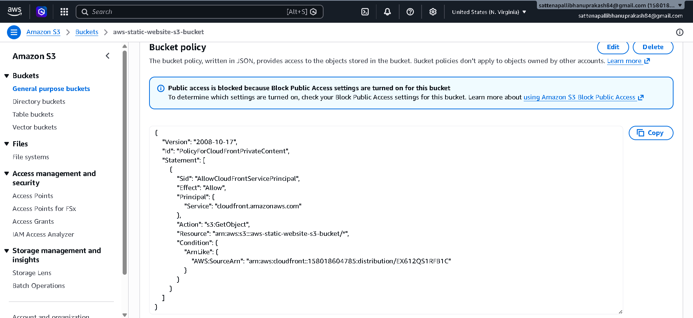

4. **Assigning the Default Root Object:** To avoid access errors when users navigate to the root domain without naming a specific file, I edited the distribution properties. I mapped the **Default root object** property directly to `index.html`. This ensures clean resolution across the global CDN domain name.
   
   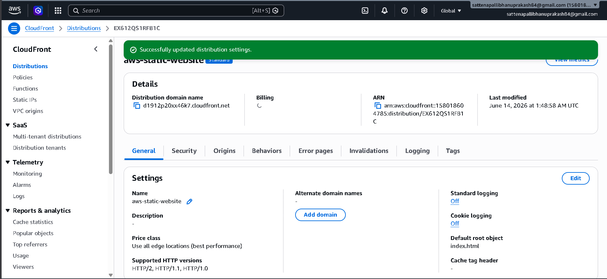

---

### Phase 3: Programmatic Identity Delegations & Access Controls (AWS IAM Engine)
Before setting up the external GitHub Actions automation runner, I needed to create a highly restricted programmatic machine identity inside AWS.

1. **Accessing the Security Directory:** I navigated to the IAM service home screen to evaluate active users and profiles before onboarding the automation identity.
   
   

2. **Programmatic IAM User Creation:** I provisioned an isolated machine IAM user profile named **`github-s3-cloudfront-deployer`**. Following zero-trust principles, I explicitly disabled AWS Management Console access, restricting this identity to API-driven programmatic interactions.
   
   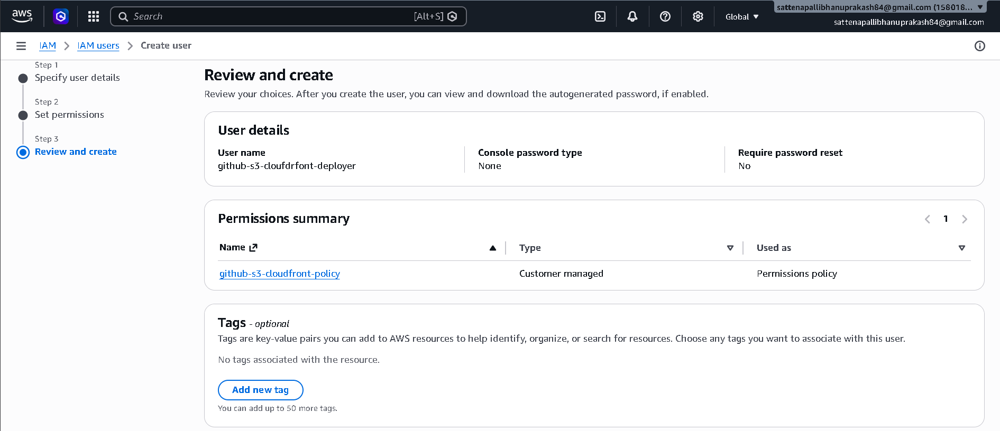

3. **Least-Privilege Policy Generation:** I engineered a custom customer-managed policy named **`github-s3-cloudfront-policy`**. This policy uses a strict least-privilege security model, granting the automation runner precisely four operational actions: reading and syncing files into storage (`s3:PutObject`, `s3:GetObject`, `s3:ListBucket`, `s3:DeleteObject`) and executing cache purges (`cloudfront:CreateInvalidation`).
   
   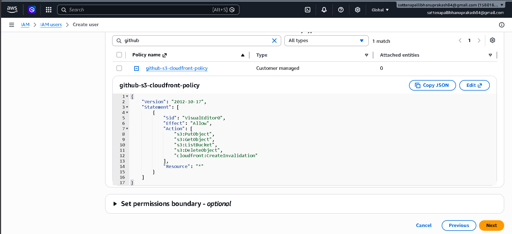

4. **API Credential Pair Selection:** Inside the newly created identity user dashboard, I selected **Security credentials** and chose the **Other** application use case category to generate secure API keys.
   
   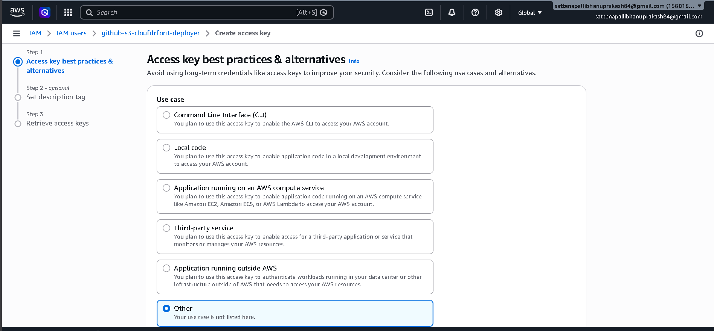

5. **API Key Generation:** The engine safely generated an **Access Key ID** and a secure **Secret Access Key** pair. These credentials authorize external deployments from the pipeline terminal.
   
   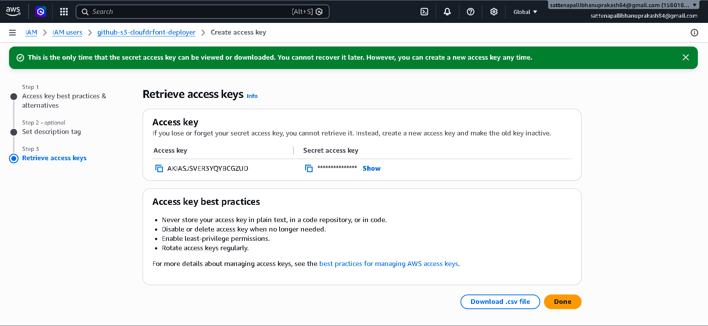

6. **Securing the Credentials Panel:** I verified that the key was active and properly attached to the user profile, with console access remaining disabled.
   
   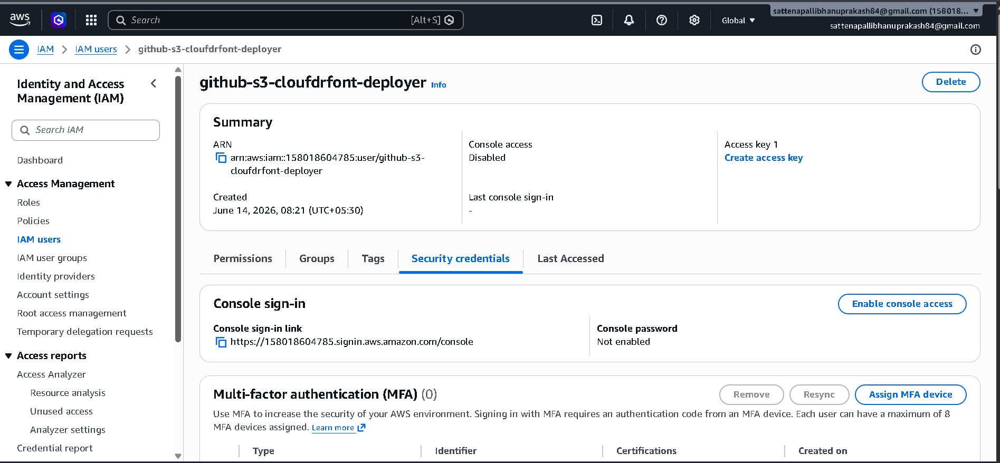

---

### Phase 4: CI/CD Pipeline Engineering & Automation (GitHub Actions & VS Code)
The final stage focused on establishing a continuous delivery pipeline that links our source code repository to our live AWS infrastructure.

1. **Repository Setup:** I created a public repository on GitHub named **`Static-Website-Project`** to manage version control for the frontend source files and deployment workflows.
   
   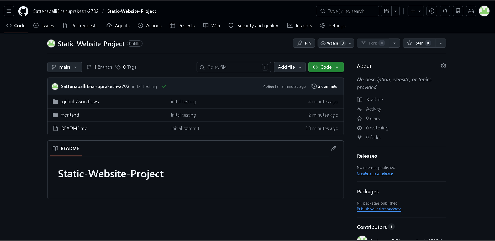

2. **Encrypted Environment Secrets Vaulting:** To safeguard our sensitive AWS API access keys, I stored them securely within GitHub's encrypted secrets environment. I mapped five environment variables: `AWS_ACCESS_KEY_ID`, `AWS_SECRET_ACCESS_KEY`, `AWS_REGION`, `S3_BUCKET`, and `CLOUDFRONT_DIST_ID`.
   
   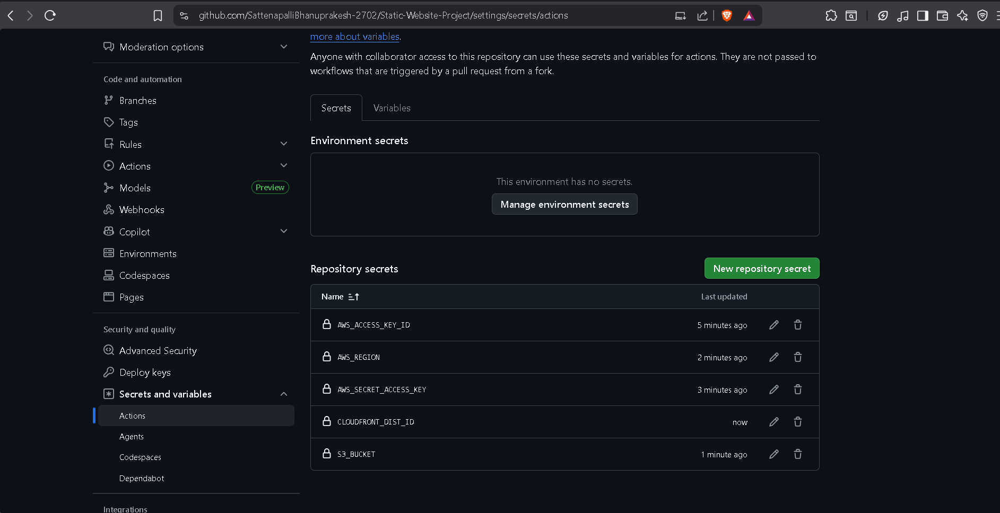

3. **Declarative Workflow Scripting:** Using **VS Code**, I created a directory structure and wrote an automated workflow configuration file at `.github/workflows/deploy.yml`. The YAML script runs on every code push to the `main` branch, triggering an Ubuntu runner to checkout the code, authenticate with AWS using our repository secrets, run an optimized `aws s3 sync --delete` command, and clear the CloudFront edge caches.
   
   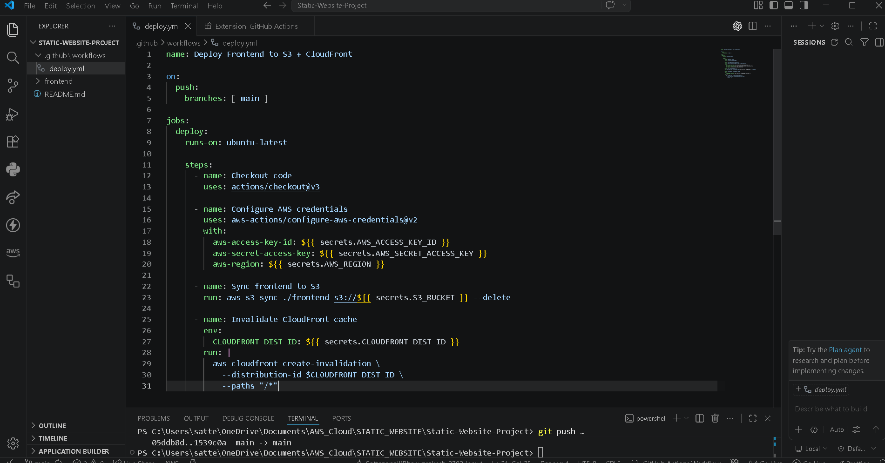

---

## 4. Production Testing & Cache Invalidation Validation

To verify the end-to-end integration of our automated infrastructure, I simulated a real-world developer update loop by modifying the website code. I changed my professional title to add my specialization, updating it from `"AWS Cloud & DevOps Engineer"` to: **`"AWS Cloud & DevOps Engineer & Cyber security"`**.

1. **Initial Baseline Verification:** I verified the website's initial live status before triggering the automated pipeline update.
   
   

2. **Manual Cache Invalidation Testing:** During early infrastructure testing, I verified the edge cache refresh mechanism by manually submitting cache invalidation requests (`/*`) through the CloudFront control panel.
   
   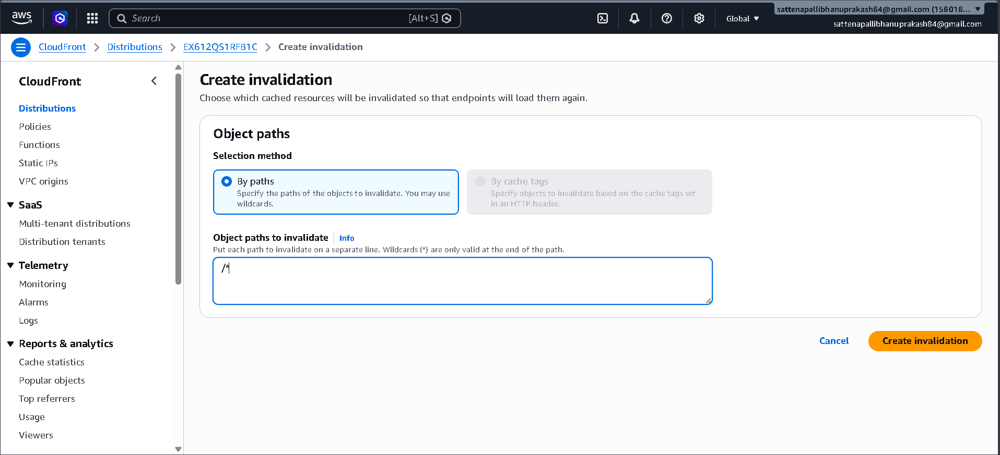

3. **Cache Processing Tracking:** The AWS edge nodes successfully processed the manual invalidation job, refreshing the global cache allocations.
   
   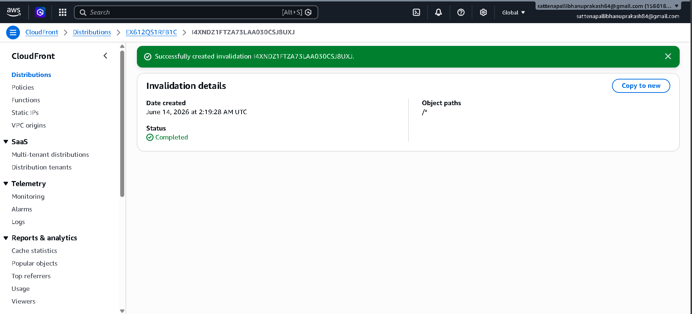

4. **Testing an Alternative Code Update Path:** To thoroughly test content revisions via the automated pipeline, I modified the top header bar to read **`"Sattenapalli BHANU PRAKASH"`**.
   
   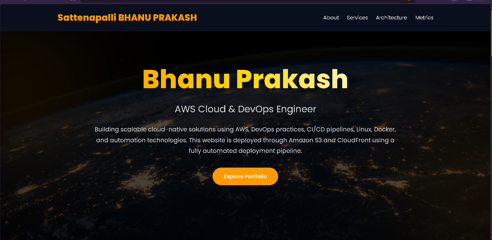

5. **Executing the Automated Pipeline:** When I ran a `git push` command, the GitHub Actions automation runner immediately picked up the commit. The runner authenticated with AWS, updated the S3 assets, and cleared the global CloudFront edge caches in just **14 seconds**.
   
   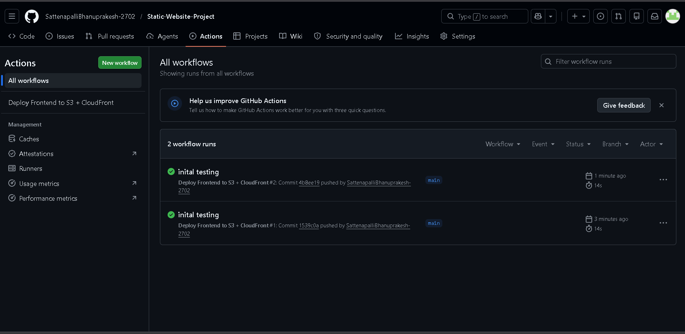

6. **Final Production Live Verification:** I performed a hard refresh in the browser to clear any local client-side caching. The live website loaded over the secure CloudFront URL, showing the updated title and layout globally.
   
   

---

## 5. Architectural Deep-Dive & Core Technical Concepts

### 1. Amazon S3 (Simple Storage Service)
Amazon S3 is an object storage service designed for high durability and scalability. In this architecture, it eliminates the need for an active web server OS. By enabling **Static Website Hosting**, S3 provides an internal HTTP routing endpoint that maps root incoming web requests directly to an asset payload like `index.html`. 

### 2. Amazon CloudFront & Edge Node Caching
Amazon CloudFront is a Content Delivery Network (CDN) service that caches static assets at Edge Locations distributed globally. When a user queries the domain name, CloudFront intercepts the connection and returns the cached objects from the closest physical network node instead of pulling them from the origin server every time. This drastically reduces round-trip latency and web page load times.

### 3. Origin Access Control (OAC) Security Paradigm
**Origin Access Control (OAC)** provides enhanced security over legacy public bucket access. OAC ensures that the S3 storage pool accepts traffic *only* when it is routed through and signed by my specific CloudFront distribution principal. This configuration prevents malicious users from bypassing CDN controls or directly hitting the origin data store.

### 4. Continuous Deployment Pipeline Mechanics
The automation framework removes manual processes from the development lifecycle. When code changes are pushed to GitHub, a virtual workflow environment runs an optimized synchronization command:

$$ \text{aws s3 sync} \quad \text{./} \longrightarrow \text{s3://bucket-name} \quad \text{--delete} $$

This synchronizes files efficiently by uploading modified data and deleting orphaned assets from the bucket. It then runs a cache invalidation request across the root path (`/*`), prompting edge caches to drop old copies and fetch the new code on the next user visit.

---

## 6. Finalized Technical Architecture Summary Matrix

| Infrastructure Layer Block | Managed AWS / DevOps Component | Underlying Security Access Mechanism | Current Deployment Verification Status |
| :--- | :--- | :--- | :--- |
| **Object Data Storage** | Amazon Simple Storage Service (S3) | CloudFront OAC Resource Restriction Only | **100% Operational (Private Backend Boundary)** |
| **Edge Distribution Cache** | Amazon CloudFront CDN Network | SSL/TLS Global Cache Invalidation Engine | **100% Operational (Edge Nodes Live Globally)**|
| **Identity Delegation** | AWS Identity & Access Management (IAM) | Programmatic Custom Least-Privilege Policy | **100% Operational (API Call Token Only)** |
| **Pipeline Orchestrator** | GitHub Actions Workflow Engine | Vault Encrypted Repository Environment Tokens | **100% Operational (14s Zero-Touch Delivery)** |